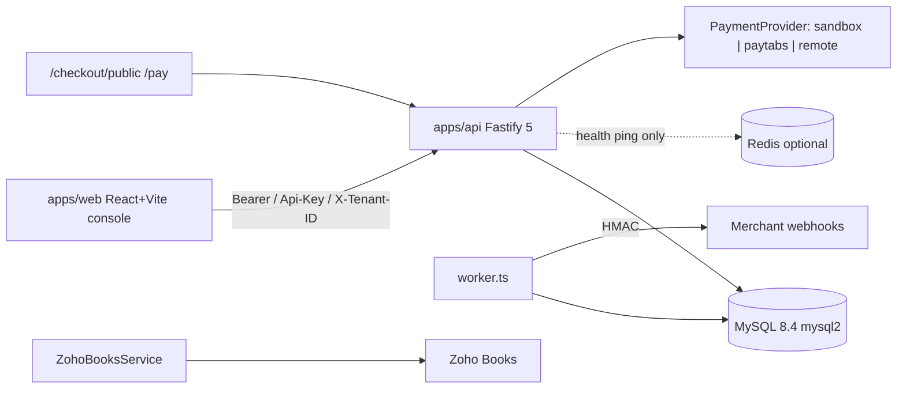
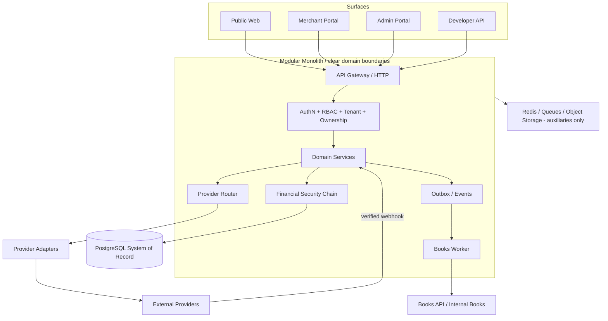

# ARCHITECTURE MAP — IMKAN Payments

**Phase:** ANALYSIS ONLY (no production code)  
**Date:** 2026-08-08  
**Authority:** V4 Final Source of Truth (`e:\process\New folder\00-FINAL-SOURCE-OF-TRUTH.md` v4.1) + Addenda 11–13  
**Current codebase:** Payment Platform V3.4.1 (`apps/api`, `apps/web`, MySQL)

---

## 1. Authority and reading order

| Priority | Source | Role |
|---|---|---|
| P0 | `e:\process\New folder\00-FINAL-SOURCE-OF-TRUTH.md` | Binding product/architecture rules |
| P0 | `...\New folder\New folder\11-COMPLETE-IMPLEMENTATION-EXPANSION.md` | Implementation detail addendum |
| P0 | `12-COMPLETE-FLOW-CHECKLIST.md`, `13-DATABASE-DETAILED-TABLE-CATALOG.md` | Flows + table catalog |
| P1 | New-folder digests `01`–`10` | Checklists aligned to `00` |
| P2 | `e:\process\01`–`11`, Downloads enhanced plan | Non-conflicting detail only |

**Conflict rule:** Prefer New-folder `00` + `11`–`13`. Log a Decision when secondary packages diverge. Do not invent Business/Financial/Provider rules.

---

## 2. Current architecture (as-built V3.4.1)

### 2.1 Runtime topology



### 2.2 Monorepo layout

| Path | Purpose |
|---|---|
| `apps/api` | Fastify TypeScript API + interval workers |
| `apps/web` | Merchant console + public checkout (single large `main.tsx`) |
| `packages/contracts` | Shared event/type contracts |
| `database/migrations` | MySQL SQL migrations `000`–`011` (+ `.bak` duplicates) |
| `tests` | Vitest domain/unit tests |
| `docs` | V1–V3 architecture/status docs (pre-V4) |
| `scripts` | Windows starters + e2e smoke |

### 2.3 Backend layers (current)

```
apps/api/src/
  server.ts / worker.ts / config.ts / security.ts
  interfaces/http/routes.ts          # nearly all HTTP surface
  application/                       # payments, billing, ledger, financial, risk, compliance, webhooks, reports
  domain/                            # payment state, ledger balance, billing math, PaymentProvider interface
  infrastructure/
    db/mysql.ts, redis.ts
    providers/sandbox|paytabs|remote|real-rails
    integrations/zoho-books.ts
```

### 2.4 Surfaces present today

| Surface | Status |
|---|---|
| Public landing / registration / email verify / password reset | Missing |
| Hosted checkout / pay result | Partial (sandbox/PayTabs redirect patterns) |
| Merchant console | Partial single-file UI (“PayPlatform”) |
| Admin portal | Missing |
| Developer API | Partial `/v1/*` (not `/api/v1` as in older API sketches) |
| KYB / Master Data / Provider Router admin | Missing or stub-level |

### 2.5 Tenancy and auth (current)

- Shared schema, row-level `tenant_id`
- Auth: session bearer, API key, MFA TOTP, RBAC via `roles`/`permissions`
- Dev bypass: non-production `X-Tenant-ID`
- Permission checks exist on some routes only — not universal

### 2.6 Financial core (current)

- Money: `DECIMAL(30,0)` **integer minor units** + runtime `BigInt`
- Ledger: double-entry posting with balance check
- Idempotency: `Idempotency-Key` + `idempotency_records`
- Transactions: `tx()` + selective `FOR UPDATE`
- Outbox: `outbox_events` + webhook delivery worker
- Settlements/payouts/reconciliation: present with sandbox/remote rails

### 2.7 Providers (current)

| Adapter | Path | Notes |
|---|---|---|
| Sandbox | `infrastructure/providers/sandbox.ts` | Default simulation |
| PayTabs | `paytabs.ts` | Hosted authorize; refunds not fully configured |
| Remote | `remote.ts` | Generic HTTP when env set |
| Real-rails | `real-rails.ts` | Optional KYC/risk/settlement/payout HTTP |
| Zoho Books | `integrations/zoho-books.ts` | Client present; HTTP routes incomplete |

**Known wiring gap:** PayTabs webhook + Zoho OAuth routes are auth-bypassed/imported but handlers are not fully registered in `routes.ts`.

---

## 3. Target architecture (V4)

### 3.1 Required surfaces

- **Public:** Landing, Registration, Login, Email Verification, Password Reset, Hosted Checkout, Payment Result, Legal
- **Merchant Portal:** full ops surface (KYB, Customers, Payments, Links, Billing, Financial, Developers, Branding, Security, …)
- **Admin Portal:** merchants, KYB review, providers/routing/health, fees, Master Data, sandbox, audit, errors, workers
- **Developer/API:** versioned API, keys, webhooks, sandbox/production separation, OAuth-ready

### 3.2 Access chain (verbatim requirement)

`User → Session → Organization/Tenant → Role → Permission → Resource Ownership`

Platform roles: `PLATFORM_OWNER`, `PLATFORM_ADMIN`, `PLATFORM_SUPPORT`, `PLATFORM_FINANCE`  
Merchant roles: `MERCHANT_OWNER`, `MERCHANT_ADMIN`, `MERCHANT_FINANCE`, `MERCHANT_SUPPORT`, `MERCHANT_DEVELOPER`, `MERCHANT_VIEWER`

### 3.3 Target runtime topology



### 3.4 Financial security chain (mandatory)

`Authentication → Session → RBAC → Tenant Isolation → Resource Ownership → Business Rules → Financial Validation → Risk → Idempotency → Concurrency Protection → DB Transaction → Provider → Verified Webhook → Ledger → Audit → Reconciliation`

### 3.5 Provider path (mandatory)

`Merchant → IMKAN API → Provider Router → Provider Adapter → External Provider`

Planned providers (capability-gated, not assumed): Stripe, Checkout, Adyen, Nuvei, Worldpay, PayTabs, MyFatoorah, Paymob, HyperPay, Moyasar, Tap, Amazon Payment Services.

### 3.6 Webhook path (mandatory)

`External webhook → signature verification → replay protection → idempotency → persist → process → domain update → ledger if applicable → audit → internal event`

### 3.7 Books path (mandatory)

`Domain Event → Outbox → Books Worker → Books Connector → Books API/Internal Books System`

### 3.8 Database (mandatory)

- **PostgreSQL only** as primary relational SoR
- Exact `NUMERIC`/`DECIMAL` money + explicit currency
- UTC timestamps; migrations only; FKs/constraints/indexes/locking
- No raw PAN/CVV; secrets not stored plaintext
- Catalog domains: Identity, Organizations, KYB, Banking, Payments, Billing, Financial, Providers, Events, Audit, Master Data  
  (see `DATABASE_MIGRATION_PLAN.md`)

---

## 4. Domain map — current vs target

| Domain | Current | Target V4 |
|---|---|---|
| Identity / Auth | Sessions, MFA, partial RBAC | Full registration, verify, reset, invitations, step-up, login_events |
| Tenant | `tenants` / `merchants` | `organizations`, `organization_users`, `organization_settings` |
| KYB | Thin compliance/KYC hooks | Full legal/business/people/docs/verification engine |
| Customers | Table + basic CRUD | Full lifecycle + unique matching strategy (**decision required**) |
| Payments | Session/Attempt/Payment | Intent → Session → Attempt → Capture → Payment |
| Payment Links | Present | First-class with statuses/ops from `11` §E (**DDL decision**) |
| Checkout / Branding | Basic public checkout | Hosted checkout + PG-stored branding, XSS-safe |
| Billing | Products/prices/subs/invoices | Full subscription ops; renewal/retry rules (**decision**) |
| Ledger / Balance | Double-entry + account_balances | Ledger SoT; Available/Pending/Reserved/Total |
| Settlement / Payout | Present (sandbox-aware) | Full lifecycle + reserves/fees tables |
| Providers | Env-selected adapter | Router + accounts + capabilities + routes + health |
| Master Data | Hardcoded/regional presets | DB-backed `master_*` tables + Admin CRUD |
| Books | Zoho client partial | Generic connector + outbox worker |
| Admin Error Center | `error_reports` tenant-scoped | Admin-only incident center with statuses |
| Audit | `audit_logs` | `audit_events` / `security_events` / `login_events` |

---

## 5. Component reuse matrix

### 5.1 Reuse with adaptation (keep concepts/code patterns)

| Component | Path | Reuse note |
|---|---|---|
| Layered API structure | `apps/api/src/{domain,application,infrastructure,interfaces}` | Preserve boundaries; retarget DB/auth |
| `PaymentProvider` interface | `domain/payments/provider.ts` | Evolve into Adapter + capability matrix |
| Sandbox provider | `infrastructure/providers/sandbox.ts` | Keep for non-production tests only |
| PayTabs adapter skeleton | `infrastructure/providers/paytabs.ts` | Rebuild against verified capabilities docs |
| Payment state machine | `domain/payments/state.ts` | Reuse logic; align Intent/Session states |
| Ledger balance check | `domain/ledger/ledger.ts` | Port to PostgreSQL NUMERIC model |
| Idempotency helper | application shared + `idempotency_records` | Rename/align to `idempotency_keys` |
| Outbox + webhook worker | `outbox_events`, `webhooks/worker.ts` | Keep reliability pattern; add inbound replay protection |
| MFA / session hashing | `security.ts`, sessions | Extend to step-up + invitation flows |
| Vitest domain tests | `tests/*.test.ts` | Expand; keep domain-first testing culture |
| Contracts package | `packages/contracts` | Expand for V4 events |
| Docker/local Windows scripts | root scripts | Retarget to PostgreSQL |

### 5.2 Rebuild / replace

| Area | Reason |
|---|---|
| MySQL engine + `mysql2` | V4 mandates PostgreSQL |
| Entire SQL migration set | Dialect, tenancy model, table catalog differ |
| `tenants` model | Replace with `organizations` membership model |
| Merchant UI monolith | Need Merchant + Admin + Public portals per UI map |
| Env-only provider selection | Need Provider Router + DB capability/routing |
| Partial RBAC | Enforce server-side on every protected operation |
| Zoho-hardwired Books | Generalize Books Connector; Zoho becomes one adapter |
| Dev `X-Tenant-ID` auth | Must not exist in production-oriented auth model |

### 5.3 Do not delete until impact confirmed

- Existing payment/refund/ledger flows and their tests
- Sandbox provider (required for test isolation)
- Outbox/webhook delivery mechanics
- Regional policy concepts (may map to Master Data / org settings — Decision)
- Seeded demo identities (migrate or replace via Decision, do not silent-drop)

---

## 6. Cross-cutting quality attributes (target)

| Attribute | V4 requirement |
|---|---|
| Security | Server-side AuthZ; MFA/step-up; no PAN/CVV; secret management |
| Financial integrity | Ledger SoT; NUMERIC money; invariants; atomic TX |
| Tenant isolation | No cross-tenant access; ownership checks |
| Auditability | Audit/security/login events for sensitive ops |
| Testability | Unit → Integration → API → E2E → Security → Financial → Readiness |
| Maintainability | Clear domain boundaries; adapters; docs/implementation records |
| Sandbox/Live | Strict isolation of credentials, data, endpoints, secrets |

---

## 7. Related analysis artifacts

- `PROJECT_GAP_ANALYSIS.md`
- `IMPLEMENTATION_PLAN.md`
- `DATABASE_MIGRATION_PLAN.md`
- `SECURITY_IMPLEMENTATION_PLAN.md`
- `TEST_PLAN.md`
- `docs/decisions/OPEN_ISSUES.md`
- `docs/implementation/00-ANALYSIS-PHASE.md`
